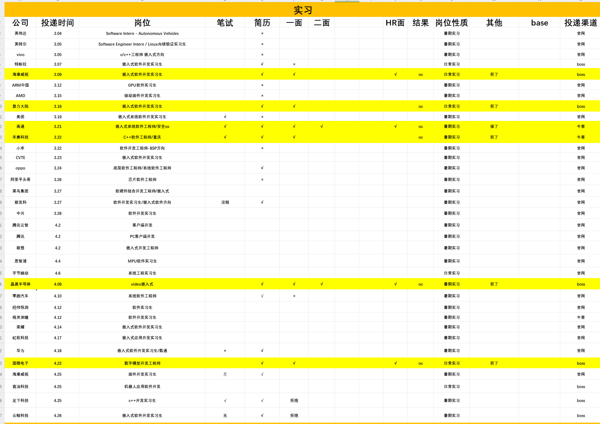

# 25届嵌入式秋招分享

## 1. 个人背景

- **学历**：双非本 末9硕
- **专业**：电子信息
- **实习经历**：一段车企大厂实习，一段外企大厂实习
- **竞赛**：国一（Robocon)  国一（研究生机器人大赛) 

**秋招感悟**：学历>实习>八股=项目

## 2. Offer 情况

### 谈薪&&签双方

- **实习转正的外企** ：总包40w+
- **Insta360**：总包40w+
- **oppo**：总包40w+
- **旷视科技**：40w+
- **地平线**：总包40w+

### hr面完泡池子

- **理想+**：操作系统
- **卓驭**：嵌入式中间件
- **商汤科技**：忘记啥岗位了
- **荣耀**：嵌入式 base深圳，说是深圳没hc
- **华子**：2012 嵌入式 中硬

### 拒面&据offer

- **经纬恒润**：主管面完了，我要了一个贼高的价，本来就不想去了，没想到还能开。
- **传音**：重庆base，钱太少了
- **赛力斯**：一样钱太少了
- **汇川联合动力**：不想去
- **vivo**：开太低
- **新凯来**：不想面试

### 面试挂

- **字节**：camera os 三面挂，三面三道leetcode ，有一道没A出来，秒挂
- **蔚来**：主管面挂，纯sb公司，面试的时候那b面试官问我问题我说完，每次都隔半分钟再说话，明显在干其他的，心不在焉，约定的时间也不准时，真sb，还说一些蔚来很屌之类的话，越想越气

- **元戎启行**：三面主管面挂，反思了一下，是他问我是否看好完全的自动驾驶，我说不看好，感觉做不到，我傻逼了，元戎不就是干这个的么。还有没有表现出十分想去他们公司的意愿。元戎的面试强度很大，每一轮都有手撕，而且问的问题也不是纯八股，问的都很有深度。

## 3. 投递情况

我投递得并不算多，总共60家左右，系统 c++，嵌入式都投，互联网基本没投

## 4. 个人简历

## 5. 技术栈&&项目

**本科阶段**：stm32+机器人 mcu嵌入式，加上一些简单的机器人控制算法

**操作系统**：一个riscv的kernel项目。cpu架构，操作系统移植，进程加载与解析，内存管理，中断处理，外设驱动。还有看了一些linux的源码。

**c++**：一个通信中间件项目。c++11的各种用法，线程池，目标池，设计模式（工厂、单例、观察者），基于原子变量的无锁设计，进程间共享内存通信，网络通信，各种数据结构（图、数组、链表），数据序列化，协程相关

**八股**：c++八股、嵌入式八股、操作系统八股，项目总结

**linux驱动**：过了一遍讯为电子的驱动文档，做了一些简单的实验，没有驱动相关项目经验

**leetcode**：250道

## 6. 项目学习与投递Timeline

**2023.1 - 2023.5 **： 开始学习kernel相关知识，先是跟着b站的up主写了一个x86的os，然后偶然的机会学习了plct实验室的rvos，然后学习了rcore项目

**2023.6 - 2023.10**：基于rcore这个rust编写的os实现自己的第一个秋招项目

**2023.10 - 2024.02**：学习了CyberRt项目，基于CyberRt实现了自己的第二个秋招项目，c++相关知识是一直都有在学

**2024.03 - 2024.05**：刷leetcode，跟着代码随想录刷，准备八股，找实习

**2024.07 - 2024.10**：一边实习，一边秋招