# 一、C/C++

## 1.1类型转换操作符

`static_cast`

- **用途**：用于编译时的类型转换，比如基本数据类型的转换（int到float等），以及向上（子类到基类）或向下（基类到子类，但不涉及多态）的类层次结构转换。
- **安全性**：相对安全，因为它不允许两个无关类型之间的转换，但不执行运行时类型检查。
- **示例**：将`float`转换为`int`，或者将基类指针转换为派生类指针（当确定转换是安全的时候）。
- 基本数据类型可以任意转换，基类和子类指针也可以互相转换，但是不能用于不同类型的转换

`dynamic_cast`

- **用途**：主要用于对象的安全向下转换（基类指针或引用转换为派生类指针或引用），并在运行时检查类型的有效性。只能用于含有虚函数的类之间的转换。
- **安全性**：相对安全，因为它在运行时检查转换的有效性。如果转换失败（例如，试图将基类指针转换为并非实际类型的派生类指针），则会返回nullptr（对于指针）或抛出异常（对于引用）。
- **示例**：在多态基类和派生类之间进行类型转换时，检查是否安全转换。
- 将基类指针转换为派生类指针，前提是转换的基类指针本身初始化时就是以new的派生类，不然会转换失败

`reinterpret_cast`

- **用途**：用于低层次的类型转换，可以将任何指针类型转换为任何其他指针类型（包括不相关的类型），也可以将指针类型转换为足够大的整型，反之亦然。
- **安全性**：非常不安全，因为它允许几乎任意的转换，不检查语义，使用时需要非常小心。
- **示例**：将指针转换为整数，或者将函数指针转换为另一种类型的函数指针。
- 和c风格的强制转换一样，可以执行任意类型的转换

`const_cast`

- **用途**：用于移除或添加对象的`const`属性（或`volatile`属性）。这通常用于指向常量的指针或引用，使之能够修改其指向的数据。
- **安全性**：使用时需要小心，因为移除`const`属性并修改数据可能会导致未定义行为，特别是如果原始对象本身是一个常量。
- **示例**：将指向常量的指针转换为指向非常量的指针，以便修改其指向的数据，但前提是知道这样做是安全的

## 1.2.智能指针

### 1.2.1 `unique_ptr`

unique_ptr的实现原理核心就是：**它对于资源是独占的，对于同一块内存只能有一个持有者**，也就是不能放在等号的右边。Unique_ptr会在栈上分配，当离开作用域后，删除里面持有的资源对象。禁用拷贝构造和拷贝赋值即可

```c++
#include <algorithm> // std::swap
template<typename T>
class UniquePtr {
public:
    // 默认构造函数
    UniquePtr() : ptr(nullptr) {}
    // 通过裸指针构造
    explicit UniquePtr(T* p) : ptr(p) {}
    // 移动构造函数
    UniquePtr(UniquePtr&& other) noexcept : ptr(other.ptr) {
        other.ptr = nullptr;
    }
    // 禁用拷贝构造函数
    UniquePtr(const UniquePtr&) = delete;
    // 移动赋值运算符
    UniquePtr& operator=(UniquePtr&& other) noexcept {
        if (this != &other) {
            delete ptr; // 删除当前对象拥有的资源
            ptr = other.ptr; // 转移资源所有权
            other.ptr = nullptr; // 清除源对象的资源所有权
        }
        return *this;
    }
    // 禁用拷贝赋值运算符
    UniquePtr& operator=(const UniquePtr&) = delete;
    // 解引用运算符
    T& operator*() const {
        return *ptr;
    }
    // 成员访问运算符
    T* operator->() const {
        return ptr;
    }
    // 获取裸指针
    T* get() const {
        return ptr;
    }
    // 释放所有权并返回裸指针
    T* release() {
        T* temp = ptr;
        ptr = nullptr;
        return temp;
    }
    // 重置指针
    void reset(T* p = nullptr) {
        T* old = ptr;
        ptr = p;
        if (old) {
            delete old;
        }
    }
    // 析构函数
    ~UniquePtr() {
        delete ptr;
    }
private:
    T* ptr; // 持有的对象指针
};

```

### 1.2.2 `shared_ptr`

`shared_ptr`共享对象的所有权，但性能略差

- 当进行**构造函数**操作时，创建一个智能指针的新的对象的时候，指针被初始化，内部的引用计数的值设置为1。
- 当进行**拷贝构造**操作时，指针会指向被赋值的指针，并且会对它们指向的资源的引用计数加1。
- 当进行**赋值构造**操作时，会先使赋值前资源的引用计数减1，如果减1后计数为0了，那么就要去释放这个资源。然后进行指针的赋值操作，然后对赋值后的新的资源的引用计数加1
- 当进行**析构操作**时，会先使引用计数的值减1，如果计数等于0了，那么就去释放资源。

```c++
template <typename T> class RefPtr
{
private:
    friend class MySharedPtr<T>;
    RefPtr(T *ptr) :p(ptr), count(1)
    {}
    ~RefPtr()
    {
        delete p;
    }
    int count;
    T *p;
};

template <typename T> class MySharedPtr
{
public:
    MySharedPtr(T *ptr) :rp(new RefPtr<T>(ptr))
    {}
    MySharedPtr(const SmartPtr<T> &sp) :rp(sp.rp) //拷贝构造
    {
        ++rp->count;
    }

    SmartPtr& operator=(const SmartPtr<T>& rhs)
    {
        ++rhs.rp->count;        //然后将引用计数减1，可以应对自赋值
            delete rp;
        rp = rhs.rp;
        return *this;
    }
    T & operator *()
    {
        return *(rp->p);
    }
    T* operator ->()
    {
        return rp->p;
    }
    ~MySharedPtr() //在SharedPtr析构时会去将引用计数-1 ，如果引用计数为0，则删除持有的指针
    {
        if (--rp->count == 0)   
        {
            delete rp;
        }
        else
        {
            cout << "还有" << rp->count << "个指针指向基础对象" << endl;
        }
    }
private:
    RefPtr<T> *rp; 
};
```

### 1.2.3 `weak_ptr`

`weak_ptr`配合`shared_ptr`，解决循环引用的问题

## 1.3 多态的实现

### 1.3.1 动态多态

何为动态多态：通过父类指针指向子类对象去执行子类重载的虚函数，每个含有虚函数的类都会有包含有一个虚函数表，这个虚函数表种存储了虚函数的调用地址

**C++的编译器保证虚函数表的指针存在于对象实例中最前面的位置**，这样通过对象实例的地址得到这张虚函数表，然后就可以遍历其中函数指针，并调用相应的函数。

虚函数表是存放在全局的只读数据段： `.rodata` ,  **一个类只能有一个虚函数表，无论这个类有多少个实例**

```c++
class A {
public:
    virtual void a() { cout << "A a()" << endl; }
    virtual void b() { cout << "A b()" << endl; }
    virtual void c() { cout << "A c()" << endl; }
    int x, y;
};

class B :public A {
public:
    int z;
    virtual void b() { cout << "B b()" << endl; }
};
```


上面的内存模型应该是这样子：

```c++
A* a1 = new A();
A* a2 = new A();
A* a3 = new B();
A* a4 = new B();
```

**基类的虚函数表和子类的虚函数表不是同一个表**，这是在编译器确定的；`ClassB`继承与`ClassA`，其虚函数表是在`ClassA`虚函数表的基础上有所改动的，变化的仅仅是在子类中重写的虚函数。如果子类没有重写任何父类虚函数，那么子类的虚函数表和父类的虚函数表在**内容上是一致的**。

在一个子类继承了多个父类的情况下，这个子类继承了多少个父类，子类就会有多少个虚函数指针，前提是基类要有虚函数才算上这个基类

> [C++ 面试必问：深入理解虚函数表 - 知乎 (zhihu.com)](https://zhuanlan.zhihu.com/p/616522622)
>
> [虚函数表存储的位置（解析C++内存分配及其编译分段）_c++虚函数存储位置-CSDN博客](https://blog.csdn.net/qq_35683407/article/details/118884877)
>
> [C++虚函数表的位置——从内存的角度 - 知乎 (zhihu.com)](https://zhuanlan.zhihu.com/p/563418849)
>
> [C++多态虚函数表详解(多重继承、多继承情况)_一个类有几个虚函数表-CSDN博客](https://blog.csdn.net/qq_36359022/article/details/81870219)

### 1.3.2 静态多态

函数重载 

函数模板

CRTP

## 1.4 右值引用和std::move


## 1.5 内存开辟与删除

### 1.5.1 程序的内存分配


所谓的程序内存其实是一个进程的内存，由于`cpu`的内存分页机制，所以对于每个进程来说都意味着自己能够占据所有的内存空间，其实是个虚拟地址空间，最后都会通过`mmu`映射到实际的物理内存

- **代码区**：放置操作系统相关的代码和数据。（用户不能直接进行操作 ------ 可以通过调用系统提供的 api 函数）
- **数据段**：存储全局变量和静态数据
- **堆区**：用于程序运行时动态内存分配，堆是向上增长的。
- **栈区**：用于存放函数的非静态局部变量、函数返回值、函数参数等，栈是向下增长的；先入后出，由栈指针维护
- **内核空间**：操作系统相关的代码和数据，一般映射到虚拟地址空间的地址最大处

### 1.5.2 malloc 和 free

`malloc`和`free`是c语言的库函数

```c
void* addr = malloc(100);
free(addr);
```

`malloc`有两种分配内存的方式

- 如果用户分配的内存小于`128KB`，则通过`brk()`系统调用申请内存。此种情况下当进程首次调用`malloc`时，`malloc`会像内核申请一块堆区的内存用作一个内存池，将申请到的内存分块，用户需要多大就从这些内存块中拿出一块，当调用`free`函数时，只会将申请到的内存还给`malloc`，而`malloc`申请到的内存不会将从操作系统分配的内存解除映射
- 如果用户分配的内存大于`128KB`，则通过`mmap()`系统调用分配内存。在此种情况下调用`free`函数，用于是直接通过`mmap`向操作系统拿到的映射内存，此时会直接调用`ummap`解除映射，从而将申请到的内存直接还给操作系统
- 不同的`glibc`中定义的阈值是不一样的
- `free`空指针不会造成崩溃，在`free`函数内部会检测传入的地址是否为空

> malloc 和 free 的原理：
>
> [malloc系列问题5-1：free函数是如何知道要释放多少内存的？ 走读glibc free函数_哔哩哔哩_bilibili](https://www.bilibili.com/video/BV1PC4y1d7Y9/?spm_id_from=333.788&vd_source=1325a6af2d360c06e8e0c5e177802b1b)
>
>  [malloc系列问题5-2：free函数是如何知道要释放多少内存的？ 走读glibc free函数_哔哩哔哩_bilibili](https://www.bilibili.com/video/BV1h34y137xJ/?spm_id_from=333.788&vd_source=1325a6af2d360c06e8e0c5e177802b1b)

除了`malloc`之外，`c`语言分配内存的函数还有

- `calloc`：只进行空间申请+零初始化
- `realloc`：如果传入的第一个参数为`nullptr`，功能等价于`malloc`；否则调整空间大小：a.直接原地调整大小 b.重新开空间，内容拷贝，释放原空间

### 1.5.3 new 和 delete

new和delete是c++的操作符，内部的操作如下：

> operator new 和 operator delete是系统提供的全局函数，new和delete会去调用

当new和delete操作基本类型时：

- new：operator new ---> malloc
- delete: operator delete ----> free
- delete [ ]: operator delete [ ] ----> operator delete --->free

当new和delete操作自定义类型时：

- new：operator new ----> malloc ---> 构造函数 ；  在为此对象申请内存后，调用此对象的构造函数
- delete：析构函数 ----> operator delete ----> free;  在delete时是先执行该对象的析构函数，然后释放掉此内存
- new []：operator new[] ----> operator new ----> malloc -----> N次构造函数
- delete []：N次析构函数----> operator delete[] ----> operator delete  ----->free


> [C/C++——new和delete的实现原理（详解）_delete[\]的实现原理-CSDN博客](https://blog.csdn.net/qq_45657288/article/details/114699235)

## 1.6 原子操作和内存模型

### 1.6.1 原子操作

原子变量是一种多线程编程种常用的同步机制。用于确保在多线程操作时对共享变量的操作在执行时不会被其他线程的操作干扰。原子变量具有原子性，对原子变量的读写要么全部一次性完成，要么全部未完成

- `std::atomic<T>`

- `is_lock_free`：是`atomic`的成员函数，用来检查此类型是否支持原子操作

- `load(std::memory_order order)`：获取当前原子变量的值

- `store(T desired,std::memory_order order)`：将指定的值写入到原子变量中

- `exchange(T new_value, std::memory_order order)`：原子地将一个原子变量的值设置为新值，并返回变量的旧值。

- `compare_exchange_weak`：

  ```
  bool compare_exchange_weak(T& expected, T desired, std::memory_order success, std::memory_order failure);
  bool compare_exchange_weak(T& expected, T desired, std::memory_order order = std::memory_order_seq_cst);
  ```

  - 函数尝试以原子方式比较原子对象的值与提供的期望值（expected value），如果这两个值相等，它就将原子对象的值设置为所提供的新值（desired value）。如果原子对象的值与期望值不相等，操作失败，`expected` 将被更新为原子变量的当前值。
  - `success` 和 `failure` 指定了在操作成功或失败时的内存顺序。如果只提供了一个 `order` 参数，它将同时用于操作成功和失败的情况。
  - 这是一个弱化版的原子操作函数，因为在某些平台上它可能会失败并重试，如果需要严格的保证原子性，应该使用`compare_exchange_strong`函数。
  - `compare_exchange_strong`函数和`compare_exchange_weak`用法一样
  - `while` + `compare_exchange_weak` 实现自旋操作

- `fetch_add`：原子加
- `fetch_sub`：原子减
- `fetch_and`：原子与
- `fectch_or`：原子或
- `fetch_xor`：原子异或


> [std::atomic::compare_exchange_weak, std::atomic::compare_exchange_strong - C++中文 - API参考文档 (apiref.com)](https://www.apiref.com/cpp-zh/cpp/atomic/atomic/compare_exchange.html)


### 1.6.2 内存模型

**缓存一致性：**

- [一小时，完全搞懂 cpu 缓存一致性 - 知乎 (zhihu.com)](https://zhuanlan.zhihu.com/p/651732241)
- 缓存一致性问题主要是为了解决在多处理器系统中，每个处理器都可能有自己的缓存，而这些处理器又可能同时访问和修改共享数据的情况下，如何保持缓存之间数据的一致性。缓存一致性的核心问题是确保在任何时刻，任何处理器上的缓存读取到的共享数据是最新的，即所有处理器对共享数据的修改都能被其他处理器感知到。

**为什么需要锁：**

- [08 | 锁：并发操作中，解决数据同步的四种方法 (geekbang.org)](https://time.geekbang.org/column/article/377913)

- 对于单核`cpu`，在多线程中，假设两个线程同时操作一片共享区，其中一个线程在对一个变量或者内存执行写操作时，还没有将数据写入到`cache`中，但是此时由于线程切换，此线程被打断，另外一个线程也对这个变量执行写操作，并且数据写入到`cache`中了，此时切换回第一个线程，第一个线程将会把修改后的数据写入`cache`，这样第二个线程做的写操作就被忽略了，这样就导致了竞态问题
- 对于多核`cpu`，在多线程中，假设多核同时访问同一个共享变量，此变量在多核的缓存中都存在，如果其中一个核心修改了此变量而没有同步就会造成竞态。

**原子性如何实现：**

- cpu提供了一些原子性的指令

- 何为原子性：

  - Q:假设我现在cpu中有两个核心，这两个核心上分别运行着两个线程，这两个线程都会去对一个int变量 i执行+1的操作，cpu会通过cpu的缓存一致性原则来保证 +1的操作是原子的吗？

  - A：原子操作是指在多线程环境中，一个操作要么完全执行，要么完全不执行，且操作过程中不会被其他线程中断。在你的例子中，两个线程对同一个变量执行+1操作，这个操作通常包括三个步骤：

    1. 读取变量i的当前值。
    2. 计算新值（即当前值+1）。
    3. 写回新值到变量i。

    即使缓存一致性机制能保证每个步骤看到的是最新的数据，但这三个步骤作为一个整体并不是原子的。如果两个线程几乎同时执行这些操作，它们可能会读取到变量i相同的初始值，分别计算出新值，并写回，导致实际上的增加操作只执行了一次而不是两次。

- 如何解决：通过cpu加偶提供的lock指定对指定内存进行锁定

  - **总线锁**：LOCK#信号就是总线锁，当一个处理器往总线上输出LOCK#信号时，其它处理器的请求将被阻塞，此时该处理器独占共享内存。总线锁这种做法锁定的范围太大了，导致CPU利用率急剧下降。
  - **缓存锁**：如果访问的内存区域已经缓存在处理器的缓存行中，P6系统和之后系列的处理器则不会声明LOCK#信号，它会对CPU的缓存中的缓存行进行锁定，在锁定期间，其它 CPU 不能同时缓存此数据，在修改之后，通过`缓存一致性`协议来保证修改的原子性，这个操作被称为“缓存锁”
  - 在CPU的LOCK信号被声明之后，在此期随同执行的指令会转换成原子指令。在多处理器环境中，LOCK信号确保，在此信号被声明之后，处理器独占使用任何共享内存。 核心意思主要说明LOCK指令在声明之后通过锁定总线，独占共享内存，通过一种排它的思想确保当前对内存操作的只有一个线程，然后确定在这段声明期间指令执行不会被打断，来保证其原子性。当使用 LOCK 指令前缀时，它会使 CPU 宣告一个 LOCK# 信号，这样就能确保在多处理器系统或多线程竞争的环境下互斥地使用这个内存地址。
  - 多核体系的原子操作就是通过缓存锁来实现的

**为什么会产生内存序的问题：**

- **cpu指令重排：**上面到在多核情况下，其中一个核心通过缓存锁实现了对一个内存的原子访问，其他核心不能去访问此内存，但是，cpu为了最大化的利用效率，可以去执行与此内存无关的后续的其他指令，产生了cpu层面的乱序执行
- **编译器优化指令重排**：编译器在编译一段业务代码时，可能会在汇编层面调整代码的运行顺序

- 因此为了能够指导编译器或者cpu对代码的执行顺序问题，因此有了内存序，内存序用于指导编译器和cpu如何去编排指令顺序
- 内存序规定了多个线程访问同一个内存地址的语义；
  - 某个线程对内存地址的更新何时能被其他线程看到 - 可见性
  - 某个线程对内存地址的访问附近可以做怎么样的优化 - 顺序性

对于原子类型上的每一种操作，我们都可以提供额外的参数，从枚举类std::memory_order取值，用于设定所需的内存次序语义（memory-ordering semantics）。

- `std::memory_order_relaxed`：**松散内存序**，不干涉指令重排，随便cpu和编译器对指令进行重排

  

- `std::memory_order_release`：**释放操作**，对应原子写操作，允许后面指令重排到写入x之前，但是不允许写入x之前的读写指令重排到写入x之后；**在运行本行代码之前，如果有任何读写内存的操作，都是不能放到本行语句之后的。**

  

  

- `std:: memory_order_acquire`：**获得操作**，对应原子读操作；意思是读取x时，后续的读写操作都不能重排到此次读之前，但是读之前的指令可以重排到此次读之后

  

- `std::memory_order_consume`

- `std::memory_order_acq_rel`：**获得释放语义**：既有写又有读的情况`写不后 && 读不前`

- `std::memory_order_seq_cst`：**顺序一致性语义**：不允许指令重排

> [C++ atomic详解 - 知乎 (zhihu.com)](https://zhuanlan.zhihu.com/p/463913671)
>
> [C++ 原子操作（原子操作以及接口、原子性实现、内存序、读线程安全）_哔哩哔哩_bilibili](https://www.bilibili.com/video/BV1pe411Z7AT/?spm_id_from=333.1007.top_right_bar_window_history.content.click&vd_source=1325a6af2d360c06e8e0c5e177802b1b)
>
> [std::memory_order - cppreference.com](https://zh.cppreference.com/w/cpp/atomic/memory_order)
>
> [c++并发编程1.内存序 - 知乎 (zhihu.com)](https://zhuanlan.zhihu.com/p/55901945)

## 1.7 多线程

## 1.8 C++基础

### 1.8.1 **C++模板类的声明和定义都要放在.h文件中**

- **编译过程**：编译器在编译代码时是一个个`.cpp`文件编译，此`cpp`文件包含的头文件的内容会被复制到`cpp`中，编译器编译完毕一个`cpp`，就会生成一个`.obj`文件，然后链接器将所有的`.obj`文件链接在一起
- **链接过程**：假设在一个`.cpp`文件中调用了这个函数，这个函数并没有在此`cpp`文件中实现而在包含的头文件中声明了，这样链接器就会认为此函数是实现在其他的`cpp`文件里了，从而在链接的过程中将此函数的实现链接过来

- **模板特性**：模板是只有在实例化的时候才会被编译成二进制代码，因为如果不调用它，那么不知道这个模板长什么样子。当编译器看到模板的声明时，并不能实例化出来模板的代码，只能**创建一个外部链接符号并期待链接器能找**到；现在假设一个模板类的声明和实现是分别在头文件和源文件中进行

  ```c++
  \\ ------- in Test.h start
  #ifndef TEST_H
  #define TEST_H
  template <typename T>
  class Test
  {
  public:
      Test(T v)
          : t (v)
      {}
      void testOutput();
  private:
      T t;
  };
   
  #endif // TEST_H
  \\ ------- in Test.h end
   
  \\ ------- in Test.cpp start
  #include "Test.h"
  #include <QDebug>
  template<typename T>
  void Test<T>::testOutput()
  {
      qDebug() << "This is a test output: " << t;
  }
  \\ ------- in Test.cpp end
   
  \\ ------- in main.cpp start
  #include <QCoreApplication>
  #include "ZDS/Test.h"
   
  int main(int argc, char *argv[])
  {
      QCoreApplication a(argc, argv);
   
      Test<int> test(13);
      test.testOutput(); // #1
   
      return a.exec();
  }
  \\ ------- in main.cpp end
  ```

  在`main.cpp`中实例化了一个`Test<int>`类型的类，此时`main.cpp`中会去调用`test.testOutput();`，但是链接器会报如下的错误;

  ```c++
  main.obj:-1: error: LNK2019: 无法解析的外部符号 "public: void __thiscall Test<int>::testOutput(void)" (?testOutput@?$Test@H@@QAEXXZ)，该符号在函数 _main 中被引用
  ```

  编译器在#1处并不知道` Test<int>::testOutput `的定义，因为它不在 `Test.h` 里面，于是编译器只好寄希望于连接器，希望它能够在其他 `.obj `里面找到 `Test<int>::testOutput` 的实例，在本例中就是 `Test.obj`，然而，后者中真有 `Test<int>::testOutput` 的二进制代码吗？NO！！！因为 C++ 标准明确表示，当一个模板不被用到的时侯它就不该被实例化出来，`Test.cpp `中用到了` Test<int>::testOutput `了吗？没有！！所以实际上 `Test.cpp `编译出来的 `Test.obj `文件中关于` Test<int>::testOutput` 一行二进制代码也没有，于是连接器就傻眼了，只好给出一个连接错误。

  但如果在`Test.cpp`中写一个函数调用`Test<int>::testOutput`，编译器就会在`Test.cpp`文件中实例化出该函数，这样`Test.obj`中就有了`Test<int>::testOutput`的地址，链接器才能够连接上。


> [C++模板类的声明和定义都要放在.h文件中_c++ 模板类 函数定义 h文件-CSDN博客](https://blog.csdn.net/RolleX/article/details/131841267?spm=1001.2101.3001.6650.2&utm_medium=distribute.pc_relevant.none-task-blog-2~default~CTRLIST~Rate-2-131841267-blog-109109110.235^v43^pc_blog_bottom_relevance_base1&depth_1-utm_source=distribute.pc_relevant.none-task-blog-2~default~CTRLIST~Rate-2-131841267-blog-109109110.235^v43^pc_blog_bottom_relevance_base1&utm_relevant_index=5)

### 1.8.2 指针和引用的区别

- 指针存放某个对象的地址，其本身就是一个变量，本身就有地址，所以可以有指向指针的指针；可变，包括其所指向的地址的改变和其指向的地址中所存放数据的改变
- 引用是变量的别名，不可变必须初始化，从底层实现来说，引用也是一个变量，这个变量中存放的是一个指针，只不过这个变量是不可修改的，可以被认为是一个`const`的指针，在用户语言层面编译器使得引用呈现出引用的特性
- 不存在指向空值的引用，但是存在指向空值的指针

> [c++中“引用”的底层实现原理详解_c++引用的底层原理-CSDN博客](https://blog.csdn.net/lws123253/article/details/80353197)

## 1.9 C语言如何实现封装、继承、多态

**封装**

- 封装就是将数据和操作函数整合在一起，这样就可以通过一个结构指针访问到所有的数据，操作所有的函数

- 在c语言中可以结合函数指针和结构体来实现

  ```c
  struct Human{
      char s[10]; //wrods
      void (*speak)(struct Human* p);
  }
  ```

**继承**

- 继承就是基于一个已有的类（父类或者基类），再创建一个新的类，这个类被称为子类或者派生类。从而避免重复编写代码。

- 在c语言里可以通过结构体嵌套的方式，实现类的继承，这里只考虑单继承的方式

  ```c
  typedef struct human {
      int age;
      char sex;
  } Human;
  
  typedef struct person{
      Human human;
      char *name;
  } Person;
  ```

**多态**

- 在c++中多态意味着通过基类指针访问子类对象，实际上就是子类在继承父类后进行创建时重新给虚函数表中的函数指针赋值了，我们也可以手动为子类和父类定义一个虚函数表，然后在构造的时候修改虚函数表中的函数指针的值

> [C语言实现面向对象三大特性 : 封装、继承、多态 (uml.org.cn)](http://www.uml.org.cn/c%2B%2B/202203304.asp)

## 1.10 C语言基础知识

### 1.10.1 struct 和 union的区别


# 二、数据结构/STL

## 2.1 pair 容器

```c++
namespace std{
	template <typename T1, typename T2>
    struct pair{
        T1 first;
        T2 second;
    }
}
```

## 2.2 vector 容器

**`push_back`与`emplace_back`的区别 **

- 假设我现在要插入一个`const T& e`

- `push_back`在内部会`new`出很多个空的`T`，然后假设现在有一个新的`T`插入，就会复制这个`T`即调用拷贝构造来为`vector`尾部空的`T`赋值
- `emplace_back`直接在容器末尾的位置构造新元素，而不是复制或移动已有对象。

## 2.3 list 容器

双向链表

## 2.4 deque容器

## 2.5 stack && queue

## 2.6 map && set

| 集合               | 底层实现 | 是否有序 | 数值是否可以重复 | 能否更改数值 | 查询效率 | 增删效率 |
| ------------------ | -------- | -------- | ---------------- | ------------ | -------- | -------- |
| std::set           | 红黑树   | 有序     | 否               | 否           | O(log n) | O(log n) |
| std::multiset      | 红黑树   | 有序     | 是               | 否           | O(logn)  | O(logn)  |
| std::unordered_set | 哈希表   | 无序     | 否               | 否           | O(1)     | O(1)     |

| 映射               | 底层实现 | 是否有序 | 数值是否可以重复 | 能否更改数值 | 查询效率 | 增删效率 |
| ------------------ | -------- | -------- | ---------------- | ------------ | -------- | -------- |
| std::map           | 红黑树   | key有序  | key不可重复      | key不可修改  | O(logn)  | O(logn)  |
| std::multimap      | 红黑树   | key有序  | key可重复        | key不可修改  | O(log n) | O(log n) |
| std::unordered_map | 哈希表   | key无序  | key不可重复      | key不可修改  | O(1)     | O(1)     |

# 三、设计模式

## 3.1 单例模式

使用`c++ 11`提供的`once_flag` 和 `call_once`来实现单例，单例需要将构造函数声明为私有的，同时删除拷贝构造和拷贝赋值函数，向外提供一个获取单例指针的接口

```c++
/*禁用拷贝构造和 = 赋值*/
#define DISALLOW_COPY_AND_ASSIGN(classname) \
  classname(const classname &) = delete;    \
  classname &operator=(const classname &) = delete;

/*利用 std::once_flag 和 std::call_once 实现的线程安全的单例宏*/
#define DECLARE_SINGLETON(classname)                                      \
 public:                                                                  \
  static classname *Instance(bool create_if_needed = true) {              \
    static classname *instance = nullptr;                                 \
    if (!instance && create_if_needed) {                                  \
      static std::once_flag flag;                                         \
      std::call_once(flag,                                                \
                     [&] { instance = new (std::nothrow) classname(); }); \
    }                                                                     \
    return instance;                                                      \
  }                                                                       \
                                                                          \
  static void CleanUp() {                                                 \
    auto instance = Instance(false);                                      \
    if (instance != nullptr) {                                            \
      CallShutdown(instance);                                             \
    }                                                                     \
  }                                                                       \
                                                                          \
 private:                                                                 \
  classname();                                                            \
  DISALLOW_COPY_AND_ASSIGN(classname)
```

> [线程安全的单例模式 · 恋恋风辰的编程笔记 (llfc.club)](https://gitbookcpp.llfc.club/sections/cpp/concurrent/concpp05.html)

## 3.2 工厂模式

> [C++ 深入浅出工厂模式（初识篇） - 小林coding - 博客园 (cnblogs.com)](https://www.cnblogs.com/xiaolincoding/p/11524376.html)
>
> [C++ 深入浅出工厂模式（进阶篇） - 小林coding - 博客园 (cnblogs.com)](https://www.cnblogs.com/xiaolincoding/p/11524401.html)

## 3.3 观察者模式

> [C++设计模式——观察者模式(Observer Pattern)_c++观察者模式-CSDN博客](https://blog.csdn.net/leonardohaig/article/details/120187956)

# 四、系统编程

## 4.1 IO

所谓`IO`即`Input ` 和 `Output`，在 Linux 哲学中有一点贯穿了 Linux 系统，那就是“一切皆文件”，Linux 将每个文件或目录都视为一个对象（除了常规的文件和目录之外，Linux 还将硬件设备、网络套接字、管道、进程、共享内存等抽象概念表示为文件），并通过文件描述符（File Descriptor）来引用它们。

### 4.1.1 文件IO

文件`IO`是操作系统提供的系统调用用于操作输出输出设备的一组函数

**打开文件**：

```c
int open(const char *pathname, int flags);
int open(const char *pathname, int flags, mode_t mode);
```

- pathname 参数用于标识需要打开或创建的文件路径和文件名。
- flags 参数 用于指定文件打开方式，可以使用按位或设置多个标志位。
- mode 参数 用于指定文件的访问权限，即文件的读、写、执行权限等。
- `open`函数返回一个文件的描述符

**关闭文件**：

```c
int close(int fd);
```

- 参数fd 是一个打开的文件描述符

**读文件**：

```c
ssize_t read(int fd, void *buf, size_t count);
```

- 返回值大于0，表示读到的字节数，等于-1代表出错，等于0代表阻塞读取
- fd 参数 文件描述符
- buf 参数 存储读取数据的缓冲区
- count 参数 读取的字节数

**写文件**：

```c
ssize_t write(int fd, const void *buf, size_t count);
```

- fd 文件描述符
- buf 要写入的数据缓冲区地址
- count 要写入的字节数

**文件读写指针**：

```c
off_t lseek(int fd, off_t offset, int whence);
```

- fd 文件描述符
- offset 偏移量
- whence 位置基点

### 4.1.2 标准IO

标准 IO（Standard I/O）是一种抽象层，用于在程序和底层操作系统 I/O 接口之间提供一个标准化的、可移植的 I/O 接口。标准 IO 提供了对文件、终端、套接字等不同类型的 I/O 设备的统一访问接口。标准 IO 主要包括以下三个文件流：

- stdin：标准输入流，通常关联着键盘输入。

- stdout：标准输出流，通常关联着控制台显示器。

- stderr：标准错误流，通常关联着控制台显示器，用于输出错误信息。

标准 IO 提供了一组函数来读写这三个文件流，包括` fopen()、fclose()、fread()、fwrite()、fseek()`等

标准IO是c语言库提供的用于在不同os上统一文件操作的函数

在标准`IO`中是用文件指针来描述一个文件:

```c
struct _IO_FILE
{
  int _flags;		/* High-order word is _IO_MAGIC; rest is flags. */

  /* The following pointers correspond to the C++ streambuf protocol. */
  char *_IO_read_ptr;	/* Current read pointer */
  char *_IO_read_end;	/* End of get area. */
  char *_IO_read_base;	/* Start of putback+get area. */
  char *_IO_write_base;	/* Start of put area. */
  char *_IO_write_ptr;	/* Current put pointer. */
  char *_IO_write_end;	/* End of put area. */
  char *_IO_buf_base;	/* Start of reserve area. */
  char *_IO_buf_end;	/* End of reserve area. */

  /* The following fields are used to support backing up and undo. */
  char *_IO_save_base; /* Pointer to start of non-current get area. */
  char *_IO_backup_base;  /* Pointer to first valid character of backup area */
  char *_IO_save_end; /* Pointer to end of non-current get area. */

  struct _IO_marker *_markers;

  struct _IO_FILE *_chain;

  int _fileno;
  int _flags2;
  __off_t _old_offset; /* This used to be _offset but it's too small.  */

  /* 1+column number of pbase(); 0 is unknown. */
  unsigned short _cur_column;
  signed char _vtable_offset;
  char _shortbuf[1];

  _IO_lock_t *_lock;
#ifdef _IO_USE_OLD_IO_FILE
};
```

**打开文件**：

```c
FILE *fopen(const char *pathname, const char *mode);
```

- pathname 字符串类型，用于标识需要打开或创建的文件路径和文件名。
- mode 该参数是一个字符串类型，用于指定文件的打开方式

**关闭文件**：

```c
int fclose((FILE *stream);
```

- stream FILE 类型指针。

**读文件**：

```c
size_t fread(void *ptr, size_t size, size_t nmemb, FILE *stream);
```

- ptr  fread()将读取到的数据存放在参数 ptr 指向的缓冲区中
- size fread()从文件读取 nmemb 个数据项，每一个数据项的大小为 size 个字节，总共读取的数据大小为`nmemb * size `个字节
- stream FILE 指针

**写文件**：

```c
size_t fwrite(const void *ptr, size_t size, size_t count, FILE *stream);
```

- ptr 为要写入的数据的缓冲区的地址
- size 为要写入的数据项的大小，count代表要写入多少个数据项，总写入的数据大小为`size *count`个字节
- stream FILE 指针

**文件指针**：

```c
int fseek(FILE *stream, long offset, int whence);
```

- stream 要设置读写位置的文件指针
- offset 相对于 whence 参数指定的位置的偏移量
- whence 指定偏移量的起始位置。

### 4.1.3 目录IO

**创建目录**：

```c
int mkdir(const char *pathname, mode_t mode);
```

- pathname 路径和文件名
- mode 权限掩码，对不同用户和组设置可执行，读，写权限，使用八进制数表示，此参数可不写。

**打开关闭目录**：

```c
DIR *opendir(const char *name);
int closedir(DIR *dirp);
```

- name 路径名字。
- dirp 要关闭的目录流指针

**读取目录**：

```c
struct dirent *readdir(DIR *dirp);
```

### 4.1.4 IO缓存


## 4.2 进程

## 4.3 线程


# 五、操作系统 

Linux内核有五大子系统，分别是进程调度系统、虚拟文件系统、内存管理单元、网络单元、进程间通信

## 5.1 内存管理


## 5.2 进程管理

### 5.2.2 进程间通信方式

**管道**

**消息队列**

**共享内存**

**信号量**

**信号**

**网络**

### 5.2.3 多线程同步

**互斥锁**

**自旋锁**

**信号量**


## 5.3 文件系统


## 5.4 网络系统


## 5.5 驱动系统


# 六、项目

## 6.1 RV64操作系统

### 6.1.1 硬件定义与启动过程

**硬件定义**：

- 首先需要定义一个结构体数组，用于存储soc的硬件以及mmio映射各硬件的地址以及大小
- 然后依次根据qemu内置的接口函数定义内存，串口，RTC，中断控制器，CPU，传递函数指针给虚拟机的类
- 注册此虚拟机

**启动流程：**

- 首先在创建`ROM`的时候会在`ROM`处写入一段复位向量的汇编代码，此段代码有如下几个功能：
  - 将处理器的硬件线程 ID（mhartid）存储到 `a0` 寄存器中
  - 将设备树的地址保存到`a1`寄存器
  - 将下一阶段的启动地址保存到`t0`计算器中，然后跳转到`t0`中保存的地址，这个地址是`Flash`的地址
- 在Flash开始位置执行`start.s`
  - 首先将编译好的固件按照一个个字节依次加载到DRAM处
  - 然后判断`hart id`是否为0，如果是则跳转到DRAM处执行
- 在DRAM处拉起os
  - DRAM开始执行的代码为OpenSBI，这是一个运行在m态的固件代码
  - OpenSBI初始化完毕一系列硬件后会跳转到os的入口地址处开始执行os代码

### 6.1.2 OpenSBI移植过程

- 首先需要按照`OpenSBI`的规则，在源码的目录下定义一个新的板级支持包，包括`Kconfig`、`objects.mk`、`platform.c`
  - `Kconfig`以及`defconfig`都是配置信息，用于标明此块板子支持哪些硬件
  - `objects.mk`中用于指明`OpenSBI`的固件类型，`OpenSBI`有三种固件类型
  - `platform.c`是用于注册板子

- 在`platform.c`中会定义一些初始化函数，这些函数是`OpenSBI`在初始化硬件时需要执行的一些函数
  - 最重要的函数为`fw_platform_init`，上一级的引导程序需要将设备树文件的内存起始地址放到`a1`寄存器中作为函数参数传递给此函数，此函数就会去解析设备树文件，`OpenSBI`就会根据设备树中的信息去初始化各个硬件了

- `start.s`会依次加载`OpenSBI`固件、设备树固件；将处理器的硬件线程 ID（mhartid）存储到 `a0` 寄存器中，将设备树的地址保存到`a1`寄存器传递给`fw_platform_init`函数

- 调用`OpenSBI`提供的运行时服务通过`ecall`指令，通过`FID`和`EID`来决定调用哪一个运行时的服务函数，会传入`a6`和`a7`寄存器，调用完毕后`OpenSBI`会将函数返回值放到`a0`和`a1`寄存器中

### 6.1.3 Trap流程

**从用户态U跳转到内核态S**

- 用户态程序调用`ecall`指令，`a7`存放系统调用号，`a0 - a5`存放系统调用的参数，调用完毕后会将系统调用的返回值放在`a0`寄存器中
- cpu会自动修改`sepc`寄存器的值为执行`ecall`后的下一条指令的地址，用于当系统调用完毕后从内核态返回跳转到此地址继续执行代码
- `scause`寄存器会被cpu修改成产生此次`trap`的原因，比如`scause`为8时代表为U模式下的系统调用
- 在内核中会提前初始化`stvec`寄存器，将发生`Trap`时的程序跳转地址放在此寄存器中，这样通过`ecall`陷入到内核态时就会去`stvec`中保存的地址开始执行代码

**内核态处理流程**

- 当`ecall`进入内核态后，内核需要保存用户态的寄存器以便在结束系统调用后恢复用户态的执行逻辑，因此需要一个内核栈来专门给内核使用，同时应用程序本身也会有一个用户栈，这是为了安全
- 进入内核态后`sscratch`寄存器中保存了内核态栈的栈顶地址，将U模式下的sp保存到`sscratch`中然后将S态下的内核栈地址取出，接着压栈，依次保存`x0-x31`的所有寄存器以及S态的`sstatus`和`sepc`寄存器
- 将用户态的寄存器保存在内核栈中后，就可去执行`trap`的处理流程了，根据sp的地址就可访问栈中每个寄存器的值，因此此时将sp当作函数参数传递给`a0`，用于`trap`处理函数的参数
- `trap_handler`会首先判断取出`a7`寄存器中的系统调用号进行分发，然后再将`a0-a5`系统调用的参数取出随之去进行处理

**从内核态S跳转到用户态U**

- 需要从栈中恢复`x0-x31`寄存器，将sp指向用户栈，然后将`sscratch`中的值设置为内核栈的地址，最后调用`sret`返回到用户态
- 在返回到用户态之前需要设置`sstatus`的`SPP`位为0告诉cpu将特权等级设置为U模式
- 此时就会返回到之前`stvec`寄存器中保存的地址

### 6.1.4 协作式多任务和分时多任务机制的实现

协作式多任务是进程主动执行`yield()`系统调用来让出cpu的使用权

**任务的切换**

- 每一个任务都有自己的内核栈和用户栈，任务的切换是在`trap`时完成的，当一个任务通过`yield()`系统调用进入内核态后会触发任务切换，任务的切换其实是来自两个不同应用在内核中的 `Trap` 控制流之间的切换。

- 在内核中定义了一个`switch`函数，此函数有两个参数，我们一个通过任务结构体来描述一个进程，因此`switch`的参数就是当前执行的进程和要切换的进程的任务描述结构体的任务上下文的地址

- 假设现在一个任务A从用户态调用`yield()`进入内核态，然后调用`switch`函数来切换，此时`A`任务的内核栈除了保存有`A`任务的用户态的`trap`上下文，还会保存内核在`trap`处理过程中留下的调用栈信息

  

- 此时`A`任务调用`switch`切换到`B`，因此需要保存当前`A`任务的执行信息，即`A`任务的任务上下文，内核维护的任务描述结构体就是用来保存当前任务的任务上下文的
- 因此在`switch`函数内部先保存`A`任务的任务上下文到他的任务描述结构体中，然后将B任务的任务描述结构体中的任务上下文加载会寄存器，然后执行换栈操作

**任务的创建**

- 任务创建时就是为每个任务新建内核栈和用户栈
- 构建任务的`trap`上下文，包括用户态的入口地址和用户栈的指针

**任务的调度**

- 在应用真正跑起来之前，需要第一次从内核态返回用户态，因此需要内核构造一个`unused`的上下文，调用`switch`函数来切换到第一个任务的`trap`上下文，由于第一个任务在创建时它的`ra`寄存器设置成了从内核态返回用户态的函数的地址，因此会在`switch`函数后去恢复第一个任务的`trap`上下文从而返回到用户态执行
- 第一个任务手动执行`yield()`会进入内核态执行切换操作，在`yiled()`系统调用中，会循环取余一个个任务循环执行

**分时多任务的实现**

抢占式多任务机制是通过RTC的时钟中断来实现的：

- 首先需要设置`status`寄存器来使能S态模式下的所有中断，然后再设置`status`寄存器开启时钟中断
- 时钟中断是通过`mtime`和`mtimecmp`这两个寄存器来实现的，`mtime`会一直递增，一旦计数器 `mtime` 的值超过了 `mtimecmp`，就会触发一次时钟中断。因此需要读取`mtime`寄存器的值和设置`mtimecmp`的值
- `S`模式下要访问`m`模式的寄存器`mtime`需要一些额外的操作，一是使用`rdtime`伪指令，二是`mtime`寄存器的值通过`mmio`映射到了一个确定的地址，我们可以通过读这个地址来获取`mtime`的值
- 在开启中断后，每产生一次时钟中断就会去`trap`处理函数中执行一次`schedule`用于切换任务，同时将`mtimecmp`的值增加，增加的数字大小为你想设置的时钟中断的频率相关

### 6.1.5 物理内存管理

**栈式物理内存管理**

- 这里的栈指的是物理内存回收栈

  ```c
  /* 内存分配器 */
  typedef struct 
  {
      uint64_t current;   //空闲内存的起始物理页号
      uint64_t  end;      //空闲内存的结束物理页号
      Stack recycled;     // 
  }StackFrameAllocator;
  ```

- `current`初始化为可用内存的起始物理页，每次申请一页内存就将`current + 1`，申请的页号就是`current +1`之前的值所代表的物理页号。`end`被初始化为可用内存的结尾位置
- 当回收内存时，会先判断回收的内存页一定小于`curreent`代表内存一定被分配出去过，然后将此页内存压栈，即放入`recycled`中保存，如果下次在申请内存就直接从`recycled`栈中`pop`出一页内存

**sv39分页机制**

- 在启用sv39分页机制后，虚拟地址只有低39位是有效的，高的25位会和第38位保持一致，因此实际上我们能访问的虚拟地址是高的256G(第38位为1)和最低的256G(第38位为0)

- 39位的虚拟地址经过mmu转换会变成一个56位的物理地址

  

- 具体的转换方式如下：

  - 每个进程都有字节的页表，分为三级，一个页表占4kb即一页内存，总共有512个页表项，每个页表项都是64位即8字节，因此`512 * 8byte = 4kb`，同时`2^9 = 512`，所以只需要一个9位的索引就能找到对应的页表项
  - 一个虚拟地址总共39位，低12位为页内偏移地址，高27位刚好分成3个9位用于三级页表寻址
  - 根页表的物理页地址存放在`satp`寄存器中，页表项的低10位为此页表项的属性，`10~54`位存储的是下级页表的物理页号
  - 在建立映射关系时，输入一个虚拟地址和想要映射的物理地址，根据虚拟地址去寻找页表，如果页表项为空，则会分配一页内存当作此页表项的下级映射的页表，然后构造此页表项，直到第三级页表，构造第三级页表时将第三级页表指向的物理页设置为输入的想要映射的物理页就建立好了映射关系

  

### 6.1.6 内核映射

- 恒等映射，依次映射代码段（可读可执行）数据段（可读可写）

.png)

### 6.1.7 应用程序的装载

- 每个应用程序都是独立的c文件，都有各自的链接脚本，编译后会被链接到一个虚拟地址，生成对应的二进制文件放在一个统一的目录下
- 使用`opendir`函数去打开存放可执行程序的目录，拿到每一个目录项，统计总共有多少个`app`以及每个应用程序的名字和每个可执行程序的二进制数据的大小
- 然后使用`fopen`函数生成一个`.s`的汇编文件，此汇编文件用于定义与可执行程序相关的变量，包括可执行程序个数和对应的名字，然后使用`incbin`这个伪指令依次将可执行程序加载到内存中，最终这些可执行程序都会被放在内核的可执行程序的数据段
- 通过此汇编文件中定义的与应用相关的符号就可以在内核中依次将应用程序的二进制数据读取出来

### 6.1.8 内核和用户程序的映射逻辑

- 内核栈和跳板页的映射：相邻的内核栈之间会存在一个空的`guard page`保护页，每个进程的栈大小为一页

  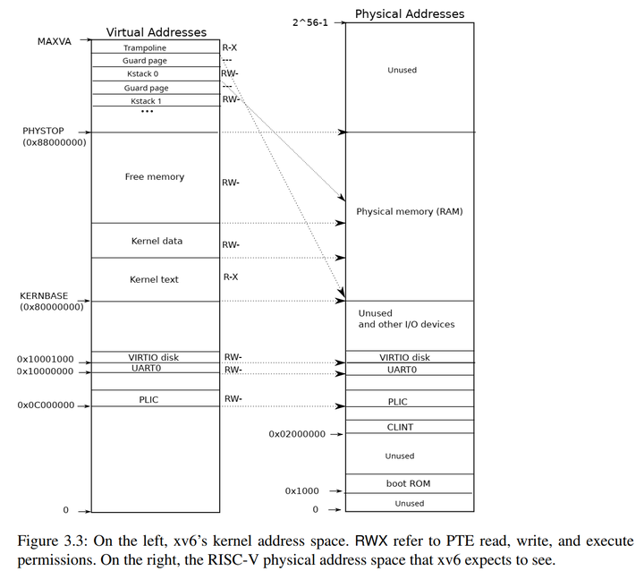

- 应用程序的映射逻辑：每个应用程序都会有一个用户栈，用户栈的虚拟地址被放在此进程的数据的最上面，用一个`guard page`隔开，防止栈溢出

  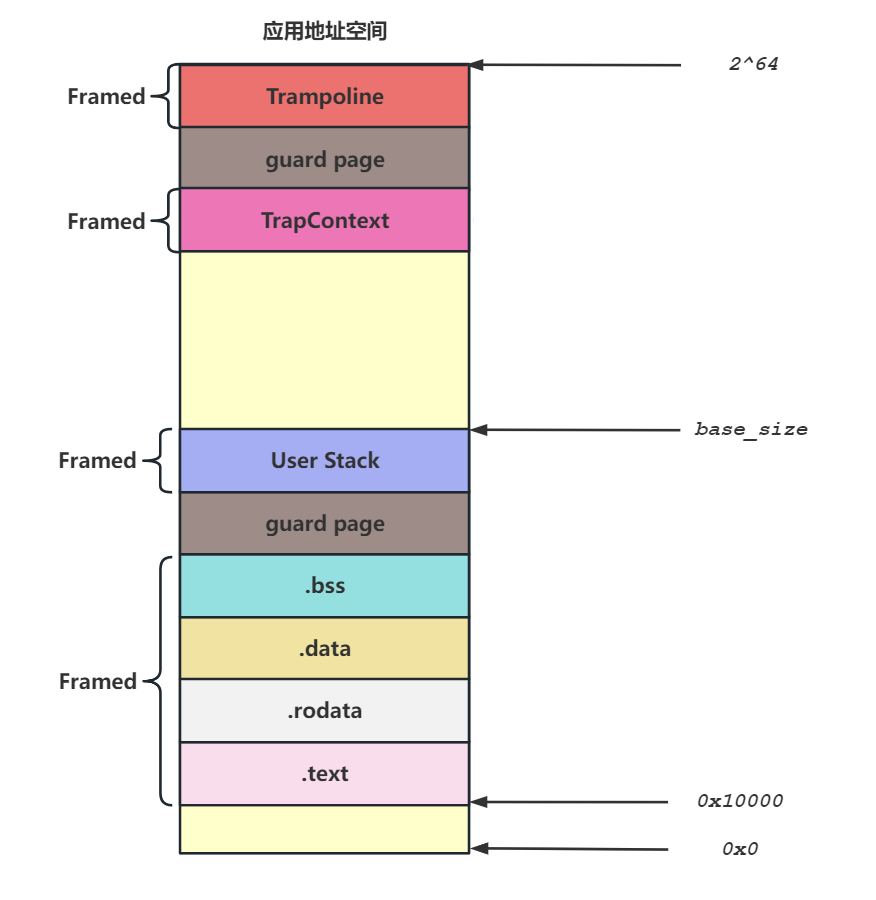

### 6.1.9 基于地址空间的分时多任务

**TCB的定义**

```c
typedef struct TaskControlBlock
{
    TaskState task_state;       //任务状态
    int pid;                    // Process ID
    struct TaskControlBlock* parent;  //Parent process
    TaskContext task_context;   //任务上下文
    u64  trap_cx_ppn;            //Trap 上下文所在物理地址
    u64  base_size;             //应用数据大小
    u64  kstack;                //应用内核栈的虚拟地址
    u64  ustack;                //应用用户栈的虚拟地址
    u64  entry;                 //应用程序入口地址
    PageTable pagetable;        //应用页表所在物理页
    u64 exit_code;              //进程退出码
}TaskControlBlock;
```

- 内核中定义了一个进程数组，用于代表多个进程：`struct TaskControlBlock tasks[MAX_TASKS];`

**内核初始化**

1. 初始化内存分配器
2. 分配内核页表，映射内核的代码段、数据段、跳板页
3. 为每个任务分配一页内存用作内核栈，然后映射内核栈，给每个任务的内核栈赋值
4. 将每个进程的状态都设置为未初始化

**应用程序初始化**

**第一步：创建任务**：

- 创建任务实际上填对应`TCB`的相关信息

- 根据`app id`为此`app`分配一页内存用于存放`trap`页
- 为此`app`创建页表，先分配根页表，然后映射跳板页和`trap`页，每个应用程序跳板页和`trap`页的虚拟地址都是固定的

**第二步：解析ELF文件**

- `ELF`文件有两种组织形式，一种是用于链接的，一种是用于执行的
- `ELF`头的信息描述了此`elf`文件的相关信息，比如魔数、架构信息、文件类型、程序入口地址、`Program Header`的偏移位置、`Program Header`中的表项数量等
  - 因此在解析对应`app`的`elf`文件时首先先解析`elf`头，判断魔数是否相等、是否为`riscv64`架构、是否为可执行文件，然后拿到此`app`的入口地址，并将此入口地址保存到此进程的`TCB`中

- 在解析完毕`elf`头后，就需要去读取`Program Header`，如果`Program Header`条目描述的具体的段是可加载的，那么为此段分配物理内存，然后将段中的二进制数据加载到分配到的物理内存中，然后为此段进行映射

**第三步：映射用户栈**

- 在解析`elf`文件时会计算此`app`的用户栈起始虚拟地址
- 分配一页内存映射用户栈

**第四步：初始化`trap`上下文和任务上下文**

- `trap`上下文中包括程序入口地址，用户栈地址，内核页表的`token`，内核栈虚拟地址

**启动应用程序**

- 构建一个空的任务上下文，调用`__switch`函数切换到第一个进程

- `__switch`会切换任务上下文，将`task[0]`的任务上下文中保存的寄存器的值恢复，其中比较重要的就是`ra`和`sp`，`sp`是当前`trap`执行流的内核栈指针，`ra`是`__switch`函数结束后返回的地址，在初始化时被设置成了`trap_return`

- `__switch`通过`sret`返回到`trap_return`执行从内核态切换到用户态的操作

  ```c
  void trap_return()  
  {  
      /* 把 stvec 设置为内核和应用地址空间共享的跳板页面的起始地址 */  
      set_user_trap_entry();
      /* Trap 上下文在应用地址空间中的虚拟地址 */  
      u64 trap_cx_ptr = TRAPFRAME;  
      /* 要继续执行的应用地址空间的 token */  
      u64  user_satp = current_user_token();  
  	/* 计算_restore函数的虚拟地址 */
      u64  restore_va = (u64)__restore - (u64)__alltraps + TRAMPOLINE;  
  	asm volatile (    
  			"fence.i\n\t"    
  			"mv a0, %0\n\t"  // 将trap_cx_ptr传递给a0寄存器  
  			"mv a1, %1\n\t"  // 将user_satp传递给a1寄存器  
  			"jr %2\n\t"      // 跳转到restore_va的位置执行代码  
  			:    
  			: "r" (trap_cx_ptr),    
  			"r" (user_satp),
  			"r" (restore_va)
  			: "a0", "a1"
  		);
    
  }
  ```

  - 先修改`stvec`的值为跳板页的地址，使内核和应用程序发生`trap`时会跳转到跳板页执行，`ecall`和中断都会到此执行
  - 计算接下来要执行的应用程序的`satp`值和`trap`上下文的虚拟地址，将会作为参数传入，然后执行跳转到`restore`处执行从内核态切换到用户态的操作
  - 在`restore`函数内部会先切换`satp`寄存器的值，此时就实现了页表的切换，然后并保存`trap`上下文的地址到`sscratch`寄存器中，然后从`trap`上下文处恢复寄存器的值
  - 然后切换`sp`为此进程的用户栈地址，最后通过`sret`返回到`sepc`寄存器指向的用户态地址开始执行应用程序

**用户态切换到内核态**

- 调用`ecall`指令会跳转到`stvec`寄存器指向的值执行即跳板页
- 跳板页开始的`__alltraps`函数会保存当前进程的`trap`上下文到此进程的`trap`页中
- 保存完毕后会切换`satp`进入内核态执行，跳转到`trap_handler`

### 6.1.10 fork系统调用的实现

在实现 fork 的时候，分为两个步骤：

- 新建一个进程，为其分配页表，分配`trap`页，映射跳板页
- 拷贝父进程的数据和子进程的一致

关键在于第二步，拷贝父进程的数据：

- 从父进程的虚拟地址空间开始，一页一页开始遍历，去三级页表中搜寻，如果此页虚拟地址被映射了，则取出实际映射的物理页，为子进程分配一页内存，然后拷贝此页的数据，然后为子进程映射，父子进程的虚拟地址空间是一样的，实际映射的物理地址不同
- 拷贝父进程的`trap`页的数据到子进程中，设置子进程的返回值为0，拷贝`TCB`的信息，比如用户栈、程序入口地址、最后初始化任务上下文

写时复制：

- 在创建子进程时只需要为子进程分配页表，将子进程和父进程的虚实映射关系都映射到父进程的物理页上
- 为每一页物理内存创建一个引用计数器，此物理页被映射依次则将引用计数增加1，只有当引用计数变成0时才释放此页内存
- `pte`的最后10位为页标志位，其中第9位和第10位为保留位，可以在第九位设置`copy`标志
- 当父进程或者子进程需要写公用的内存时，此时会触发`trap`的`store page falut`，如果此页是`cow`页面，并且引用计数大于一，则申请一页新的物理内存，然后拷贝，重新进行映射，映射完毕后清楚`cow`标志位

> [xv6实验课程--xv6的写时拷贝(COW)(2021)_usertrap(): unexpected scause 0x0000000000000002 p-CSDN博客](https://blog.csdn.net/lhwhit/article/details/120669827)

### 6.1.11 exec系统调用的实现

在实现 `exec` 的时候，分为两个步骤：

- 为新的进程分配页表，建立映射关系
- 销毁原有进程，解除映射关系，回收占用的物理页帧

第一步和创建新进程一样

- 检查`elf`，分配页表，加载`elf`，映射`trap`上下文、映射跳板页、映射用户栈、映射`elf`中被加载的段

第二步解除映射关系，释放物理内存

- 解除跳板页的映射，不删除跳板页对应物理内存
- 解除`trap`上下文页的映射，不删除`trap`上下文对应的物理内存，因为的新的进程在映射时使用的也是这片内存
- 解除进程的数据的映射，一页一页解除映射

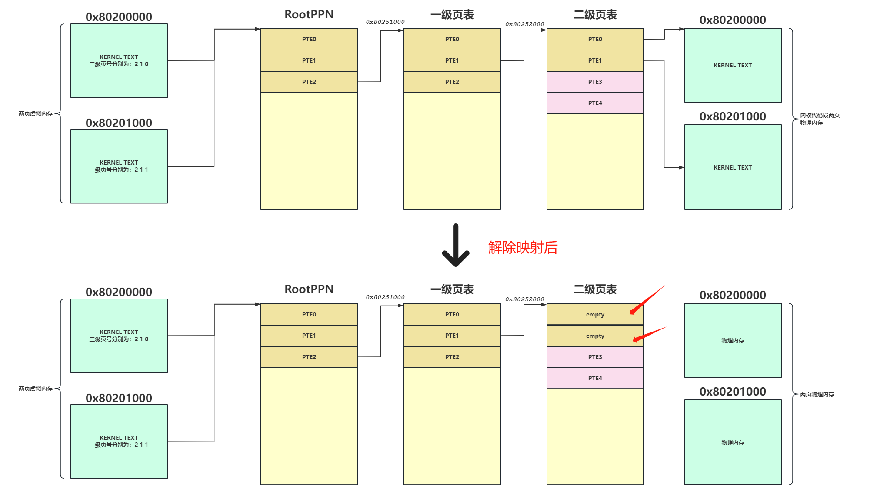

- 解除映射后，所有的二级页表都变成了空，接下来就是遍历三级页表，将所有的页表项设置为空，然后将三级页表所占的物理页的内存释放掉

## 6.2 Onix 32位X86操作系统


## 6.3 中间件

### 6.3.1 传感器中间件

- 通过`.ini`格式的配置文件传递传感器的相关配置参数，比如设备名、设备描述符、波特率等，内部编写了一个`ini`文件解析器
  - 使用`ifstream`来一行一行读取文件数据
  - `ini`文件是用一个个`section`来组织的，每次读取一个`section`
  - 解析`ini`的这个类是一个全局单例
- 定义了一个抽象类`SensorDevice`由于统一传感器的接入接口，每类传感器的驱动都需要继承此类重写类中的虚函数，然后调用一个宏来注册
- 注册宏的两个参数为`SensorDevice`这个父类和具体的传感器子类的名字，在注册宏的内部会使用一个哈希表，此哈希表的`key`为子类的类名，`value`为创建这个子类的抽象工厂类
- 使用宏注册的时候为每一个具体的传感器子类生成一个工厂类，这个工厂类中有一个`CreateObj`函数，可以根据注册宏中传入的子类的名字来进行`new`，因此将此创建的工厂类保存到哈希表中
- 经过上面的注册后，想要创建一个具体的传感器子类，只需要根据子类传感器的名字去哈希表中索引拿到创建此子类的工厂，然后调用工厂的创建函数即可拿到具体传感器的类指针
- 然后封装一层，用户只需要使用`ini`配置文件传入想要使用的传感器的名字，应用程序会去解析配置文件信息，然后去哈希表中索引到操作此传感器的子类，调用操作接口就可获取数据了
- 在内部还使用`udev`来实现了一个传感器的拔插检测机制，对于走网络的传感器需要额外操作

### 6.3.2 通信中间件

#### 6.3.2.1 基础库

无锁队列

无锁哈希表

原子读写锁

#### 6.3.2.2 订阅回调实现


#### 6.3.2.3 日志库

写日志：

- 定义了一个`Logger`的类，它是一个单例，内部会有一个`open`函数用于打开一个文件，后续日志的写入都是填充到此文件中
- 核心的写日志的函数为`log`，传入的参数为日志的级别以及行号，文件名等；然后还有要写入的数据，写入的数据是可变参数类型。通过c++的`ostringstream`来接收要写入的流式数据
  - 首先使用时间库获得当前的时间，然后使用`snprintf`格式化字符串将时间、日志级别、文件名、行号等打包成一个字符串写入到输入流中
  - 然后将可变参数通过`vsnprintf`打包成字符串写入到输入流中
  - 最后将输入流中的字符串写入到文件中

**文件自动轮转**：

- 在上面写日志的过程中会记录此时文件写入字符数的数量，如果字符数量超过事先定义的值，则会重新创建一个新的文件用于日志写入

**RAII流式写入：**

- 定义了一个辅助类`LogStream`，此辅助类内部维护了一个`ostringstream`支持流式写入数据，在`LogStream`的析构函数中会去调用`Logger::log()`函数将`ostringstream`接收到的字符串一次性写入

#### 6.3.2.4 序列化


#### 6.3.2.5 共享内存的通信方式实现


#### 6.3.2.6 基于有向图的网络拓扑

# 七、嵌入式 

## 7.1 通讯协议

### 7.1.1 IIC

物理I2C接口有两根双向线，**串行时钟线（SCL）**和**串行数据线（SDA）**组成，可用于发送和接收数据，但是通信都是由主设备发起，从设备被动响应，实现数据的传输。每个连接到总线上的IIC设备都有唯一的地址，任何设备既可以作为主机也可以作为从机，但是同一时刻只允许有一个主机

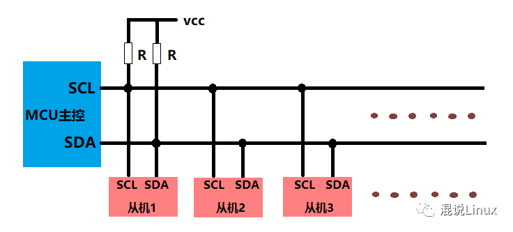

IIC通信有两种实现方式

- 使用IIC控制器实现
- GPIO软件模拟实现

IIC总线协议无非就是几样东西：**起始信号**、**停止信号**、**应答信号**、以及**数据有效性**。

**一. 空闲状态**

- **时钟线（SCL）和数据线（SDA）接上拉电阻**，**默认高电平**，**表示总线是空闲状态**。

**二. 从设备地址**

- 从设备地址用来区分总线上不同的从设备，一般发送从设备地址的时候会在最低位加上读/写信号，比如设备地址为0x50，0表示读，1表示写，则读数据就会发送0x50，写数据就会发送0x51。

**三. 起始(START)信号**

- I2C通信的起始信号由主设备发起，SCL保持高电平，SDA由高电平跳变到低电平。

  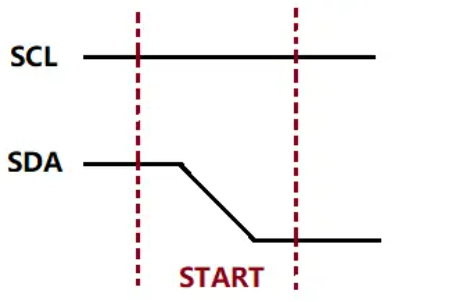

**四. 停止(STOP)信号**

- I2C通信的停止信号由主设备终止，SCL保持高电平，SDA由低电平跳变到高电平。

  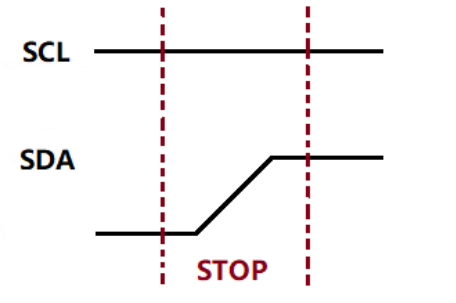

  **五. 数据读取**

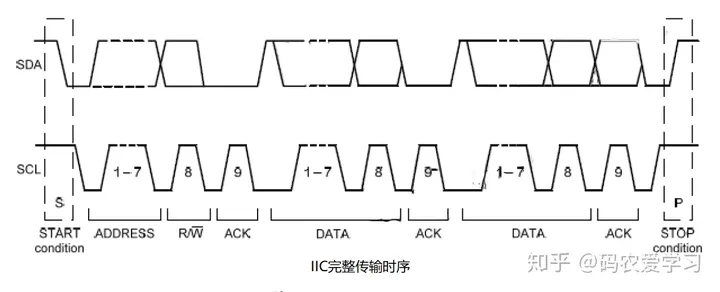

- 开始标志（S）发出后，主设备会传送一个7 位的Slave 地址，并且后面跟着一个第8位，称为Read/Write 位。
- R/W 位表示主设备是在接受从设备的数据还是在向其写数据。
- 然后，主设备释放SDA 线，等待从设备的应答信号（ACK）。每个字节的传输都要跟随有一个应答位。
- 应答产生时，从设备将SDA 线拉低并且在SCL 为高电平时保持低。
- 数据传输以停止标志（P）结束，然后释放总线。但主设备也可以产生重复的开始信号去操作另一台从设备，而不发出结束标志。
- **所有的SDA 信号变化都要在SCL 时钟为低电平时进行，除了开始和结束标志**
- 时钟线SCL是一种间歇性的方波（需要通信时才产生方波）
- 数据线SDA根据SCL提供的节拍，高电平代表数据1，低电平代表数据0
- 没有数据传输时，SDA和SCL均为高电平状态
- 起始信号后，数据是9个一组，包括8位的数据和另一方的1位回应

> [IIC通信协议，搞懂这篇就够了 - 知乎 (zhihu.com)](https://zhuanlan.zhihu.com/p/503219395)
>
> [从IIC实测波形入手，搞懂IIC通信 - 知乎 (zhihu.com)](https://zhuanlan.zhihu.com/p/161710767)

### 7.1.2 UART

**串口** 、**RS232** 、**RS485**

UART,232,485都是串口，只是电平不一样

> [一文搞懂UART通信协议 - 知乎 (zhihu.com)](https://zhuanlan.zhihu.com/p/600121894)

### 7.1.3 SPI

四根线，全双工，其中一根时钟线用于同步，一根线用于寻址，另外两根线用于数据传输

> [SPI协议详解（图文并茂+超详细） - 知乎 (zhihu.com)](https://zhuanlan.zhihu.com/p/290620901)

### 7.1.4 CAN


## 7.2 常用硬件

# 八、计算机网络

# 九、ARM体系架构

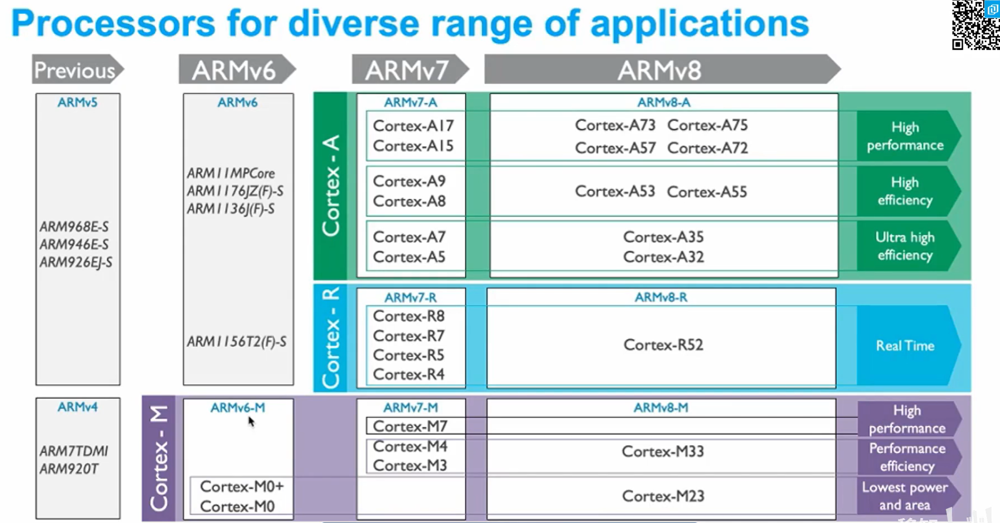

- ARM有三种不同系列的处理器，分为`A`、`R`、`M`三种系列，同时有多种架构，比如`ARMv6`、`ARMv7`、`ARMv8`。
  - `M`系列处理器主要是低性能芯片，应用于单片机领域
  - `A`系列处理器主要是高性能芯片，跑`Linux`系统
  - `R`系列处理器实时性较强，芯片性能高于`M`系列，主要应用于工业领域

- `ARMv8`的M系列处理器相比于`ARMv7`的`Cortex-M`系列增加了`Trustzone`，即安全域的拓展

## 9.1 M系列架构分析

> [01_ARMv7-M_处理器架构技术综述 | Carlos's Tech Blog (gitbook.io)](https://carloss-organization-4.gitbook.io/tech/tech/arm/arm-v7-m/01armv7m-chu-li-qi-jia-gou-ji-shu-zong-shu)
>
> [嵌入式笔记2.1 ARM Cortex-M3M4汇编指令集 - 一只心耳 - 博客园 (cnblogs.com)](https://www.cnblogs.com/YZXE/p/18098675)
>
> [ARM Cortex-M 系列处理器权限模式介绍 | 我写的诗有点冷 (x-codingman.github.io)](https://x-codingman.github.io/2020/11/01/arm_mode/)

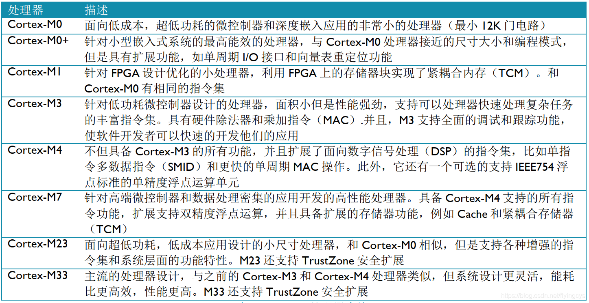

M系列的处理器从**架构层面**有以下特点：

- 三级流水线设计；
- 哈佛总线架构，且具有统一的存储器空间:指令和地址总线使用相同的地址空间；
- 32位寻址，支持4GB存储空间； 
- 名为**NVIC**（Nested Vectored Interrupt Controller，嵌套向量中断控制器）的中断控制器，支持最多240 个中断请求和8 ~256 个 中断优先级 ( 取 决 于 实 际 的 芯 片 设 计 )
- 支持多种OS特性，如节拍定时器以及影子栈指针等。
- 休眼模式和多种低功耗特性。
- 支持可选的**MPU( 存储器保护单元)**,提供了可编程存储器或访问权限控制等存储器 保护特性。
- 通过位段特性支持两个特定存储器区域中的位数据访问。
- 可以选择使用单个或多个处理器。

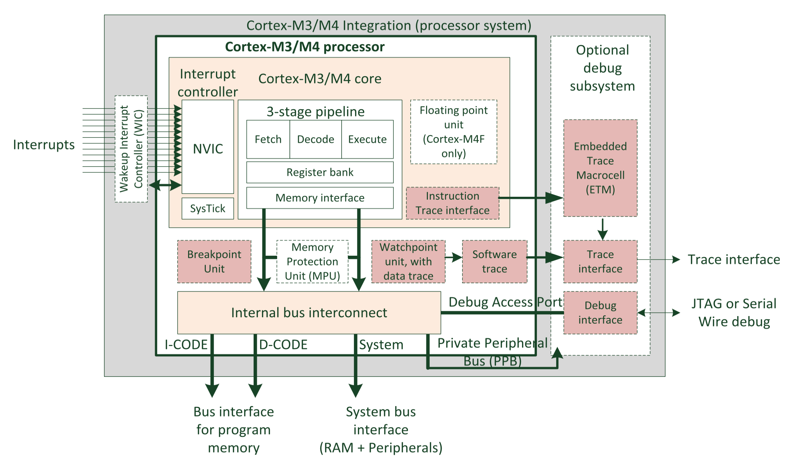

### 9.1.1 寄存器组成


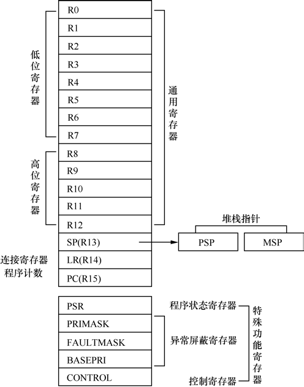

-  R0～R12 是最具“通用目的”的 32 位通用寄存器，用于数据缓冲操作。该类寄存器分为两组：一组被称为低位寄存器， R0～R7，它们能够被所有通用寄存器指令访问；另一组被称为高位寄存器， R8～R12，它们能够被所有 32 位通用寄存器指令访问，而不能被所有 16 位通用寄存器指令访问。
- 寄存器 R13 被用作栈指针，用于访问 RAM 中的栈区。在 Arm 架构中， SP 的最低两位被忽略，相当于 SP 的最低两位永远是 0，所以 SP 的值是 4 的整数倍，那么 SP 指向的 RAM 地址也是 4 的整数倍，即是按照 4 字节对齐的。 Arm 是 32 位机，机器字长为 32 位， 4 字节对齐表示栈中的数据存储是按照字对齐的。在图中， SP（R13）右侧的箭头 “→” 指向了SP的两个名字： PSP、 MSP。主栈指针MSP是复位后缺省使用的栈指针，用于操作系统内核以及异常处理例程（包括中断处理程序）。“Handler”模式通常使用主栈指针（Main Stack Pointer，MSP），但是也可以使用进程栈指针（Processor Stack Pointer， PSP）。
-  寄存器 R14 也称作连接寄存器（Link Rigister，LR），用 于保存函数或子程序调用时的返回地址。 LR 也被用于异常返回。在其他情况下，可以将 R14 作为通用寄存器来使用。类似于RISCV的`ra`寄存器
- 寄存器R15 是程序计数寄存器，指示将要执行的指令在存储器中的位置。复位的时候，处理器的硬件机制自动将复位向量值放入PC。 如果修改它的值，就能改变程序的执行流。该寄存器的第 0 位若为 0，则指令总是按照字对齐或者半字对齐。 PC能以特权或者非特权模式进行访问。

### 9.1.2 特权级


### 9.1.3 中断控制器

## 9.1 A系列架构分析

> [ARM 37 个通用寄存器详解_arm寄存器-CSDN博客](https://blog.csdn.net/weixin_42109053/article/details/128055828)

# 十、Linux驱动

## 10.1 字符设备驱动

定义驱动初始化函数

1.创建设备号，分配设备号

2.定义`file_operations`结构体，填充其中的`open`、`read`、`write`、`release`等函数

3.初始化字符设备类`cdev`

4.添加一个`cdev`，完成字符设备注册到内核

5.创建类`class`

6.创建字符设备`device`

定义驱动出口函数

通过`module_init`，注册驱动

# 十一、Linux 系统与Uboot

## 11.1 Linux系统的启动过程

